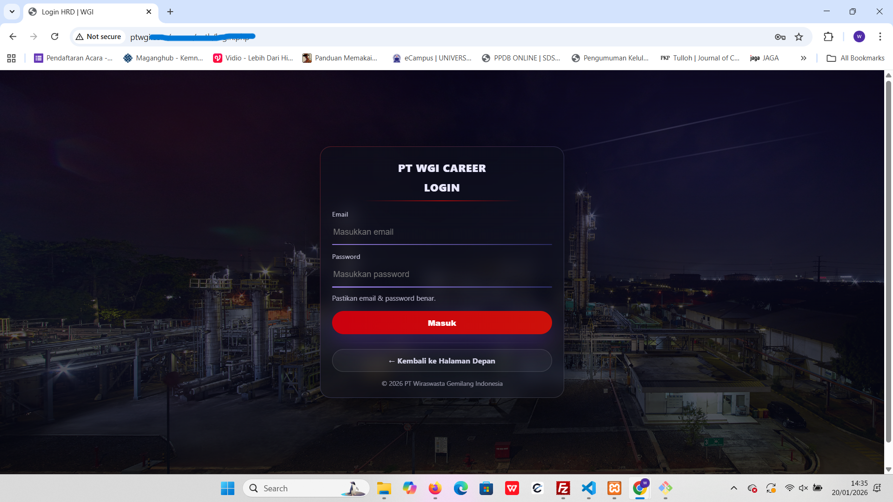

# HRD Project – Website Recruitment  
**PT Wiraswasta Gemilang Indonesia**

Sistem **Website Recruitment** yang dikembangkan untuk mendukung proses rekrutmen karyawan secara **digital, terstruktur, dan terintegrasi**, mulai dari publikasi lowongan hingga pengelolaan tahapan seleksi oleh tim HRD.

---

## 🎯 Tujuan Sistem
Website ini dibuat untuk:
- Mempermudah kandidat dalam melamar pekerjaan secara online  
- Membantu HRD mengelola data pelamar dan proses seleksi  
- Menyediakan dashboard monitoring rekrutmen secara real-time  
- Meningkatkan efisiensi dan profesionalisme proses rekrutmen perusahaan  

---

## 🏠 Halaman Karier (Landing Page)

**Deskripsi:**  
Halaman utama website recruitment yang menampilkan:
- Informasi umum karier di PT Wiraswasta Gemilang Indonesia  
- Pencarian lowongan berdasarkan **posisi** dan **lokasi**  
- Akses ke daftar lowongan yang sedang dibuka  

---

## 📋 Lowongan Tersedia

**Deskripsi:**  
Menampilkan daftar lowongan aktif lengkap dengan:
- Nama posisi  
- Lokasi penempatan  
- Tipe pekerjaan (Full Time)  
- Ringkasan **Job Description** dan **Kualifikasi**  
- Batas akhir pendaftaran  
  
Menampilkan informasi detail setiap lowongan, meliputi:
- Deskripsi pekerjaan secara lengkap  
- Kualifikasi yang dibutuhkan  
- Lokasi kerja  
- Tombol **Apply Sekarang** untuk melamar  

---

## 📝 Form Apply Lamaran

**Deskripsi:**  
Form pendaftaran online bagi pelamar yang berisi:
- Nama lengkap  
- Email aktif  
- Nomor telepon / WhatsApp  
- Kota / Kabupaten  
- Tanggal lahir  + Sudah Otomatis Usia
- Pendidikan terakhir & Program Studi 
- Upload CV dalam format **PDF**  

Data yang dikirim akan langsung tersimpan ke sistem dan masuk ke tahap seleksi HRD.

---

## 🔐 Login HRD

**Deskripsi:**  
Halaman autentikasi khusus **Admin / HRD** untuk mengakses sistem manajemen rekrutmen secara aman.

---

## 📊 Dashboard Admin HRD

**Deskripsi:**  
Dashboard utama HRD yang menampilkan:
- Total lowongan aktif  
- Total pelamar  
- Status pelamar berdasarkan tahapan seleksi  
  - Initiate Call  
  - Interview  
  - Psikotest  
  - MCU  
  - Onboarding  
- Grafik pelamar per posisi  
- Kalender Pengingat aktivitas rekrutmen Secara otomatis Muncul Notif dan Loncheng Suara.  

Dashboard ini membantu HRD melakukan monitoring dan pengambilan keputusan secara cepat dan akurat.

---

## 🛠️ Teknologi yang Digunakan
- **PHP Native**
- **MySQL**
- **HTML5**
- **API**
- **CSS3**
- **JavaScript**
- **Bahasa Program lainnya**
- **Git & GitHub**
- **XAMPP (Local Development)**

---

## 👨‍💻 Developer
**Hidayat Tulloh**  
Teknik Informatika  
Project: *HRD Website Recruitment – PT Wiraswasta Gemilang Indonesia*

---

## 📌 Catatan
Proyek ini dikembangkan sebagai:
- Sistem internal perusahaan  
- Portofolio pengembangan web  
- Implementasi sistem rekrutmen berbasis web yang profesional  

© 2026 HRD PROJECT 

Sistem **Website Recruitment** yang dikembangkan untuk mendukung proses rekrutmen karyawan secara **digital, terstruktur, dan terintegrasi**, mulai dari publikasi lowongan hingga pengelolaan tahapan seleksi ol>

---

##  M-/ Tujuan Sistem
Website ini dibuat untuk:
- Mempermudah kandidat dalam melamar pekerjaan secara online
- Membantu HRD mengelola data pelamar dan proses seleksi
- Menyediakan dashboard monitoring rekrutmen secara real-time
- Meningkatkan efisiensi dan profesionalisme proses rekrutmen perusahaan

---

##  M-  Halaman Karier (Landing Page)

**Deskripsi:**
Halaman utama website recruitment yang menampilkan:
- Informasi umum karier di PT Wiraswasta Gemilang Indonesia
- Pencarian lowongan berdasarkan **posisi** dan **lokasi**
- Akses ke daftar lowongan yang sedang dibuka

---

##  ~K Lowongan Tersedia

**Deskripsi:**
Menampilkan daftar lowongan aktif lengkap dengan:
- Nama posisi
- Lokasi penempatan
- Tipe pekerjaan (Full Time)
- Ringkasan **Job Description** dan **Kualifikasi**
- Batas akhir pendaftaran

Menampilkan informasi detail setiap lowongan, meliputi:
- Deskripsi pekerjaan secara lengkap
- Kualifikasi yang dibutuhkan
- Lokasi kerja
- Tombol **Apply Sekarang** untuk melamar

## 🏠 Halaman Karier (Landing Page)

**Deskripsi:**  
Halaman utama website recruitment yang menampilkan:
- Informasi umum karier di PT Wiraswasta Gemilang Indonesia  
- Pencarian lowongan berdasarkan **posisi** dan **lokasi**  
- Akses ke daftar lowongan yang sedang dibuka  

---

## 📋 Lowongan Tersedia

**Deskripsi:**  
Menampilkan daftar lowongan aktif lengkap dengan:
- Nama posisi  
- Lokasi penempatan  
- Tipe pekerjaan (Full Time)  
- Ringkasan **Job Description** dan **Kualifikasi**  
- Batas akhir pendaftaran  
  
Menampilkan informasi detail setiap lowongan, meliputi:
- Deskripsi pekerjaan secara lengkap  
- Kualifikasi yang dibutuhkan  
- Lokasi kerja  
- Tombol **Apply Sekarang** untuk melamar  

---

## 📝 Form Apply Lamaran

**Deskripsi:**  
Form pendaftaran online bagi pelamar yang berisi:
- Nama lengkap  
- Email aktif  
- Nomor telepon / WhatsApp  
- Kota / Kabupaten  
- Tanggal lahir  + Sudah Otomatis Usia
- Pendidikan terakhir & Program Studi 
- Upload CV dalam format **PDF**  

Data yang dikirim akan langsung tersimpan ke sistem dan masuk ke tahap seleksi HRD.

---

## 🔐 Login HRD

**Deskripsi:**  
Halaman autentikasi khusus **Admin / HRD** untuk mengakses sistem manajemen rekrutmen secara aman.

---

## 📊 Dashboard Admin HRD

**Deskripsi:**  
Dashboard utama HRD yang menampilkan:
- Total lowongan aktif  
- Total pelamar  
- Status pelamar berdasarkan tahapan seleksi  
  - Initiate Call  
  - Interview  
  - Psikotest  
  - MCU  
  - Onboarding  
- Grafik pelamar per posisi  
- Kalender Pengingat aktivitas rekrutmen Secara otomatis Muncul Notif dan Loncheng Suara.  

Dashboard ini membantu HRD melakukan monitoring dan pengambilan keputusan secara cepat dan akurat.

---

## 🛠️ Teknologi yang Digunakan
- **PHP Native**
- **MySQL**
- **HTML5**
- **API**
- **CSS3**
- **JavaScript**
- **Bahasa Program lainnya**
- **Git & GitHub**
- **XAMPP (Local Development)**

---

## 👨‍💻 Developer
**Hidayat Tulloh**  
Teknik Informatika  
Project: *HRD Website Recruitment – PT Wiraswasta Gemilang Indonesia*

---

## 📌 Catatan
Proyek ini dikembangkan sebagai:
- Sistem internal perusahaan  
- Portofolio pengembangan web  
- Implementasi sistem rekrutmen berbasis web yang profesional  

© 2026 HRD PROJECT 
