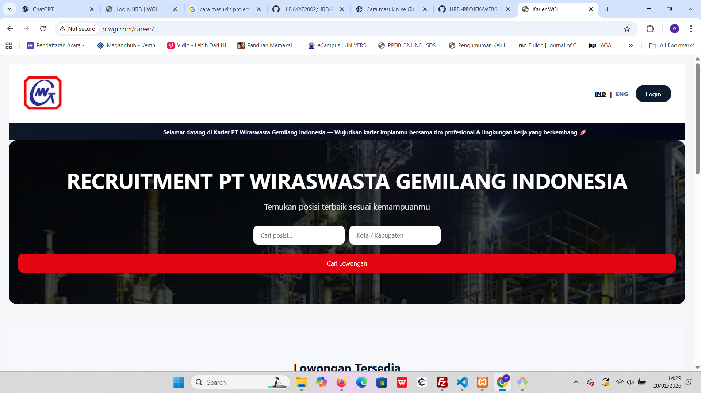
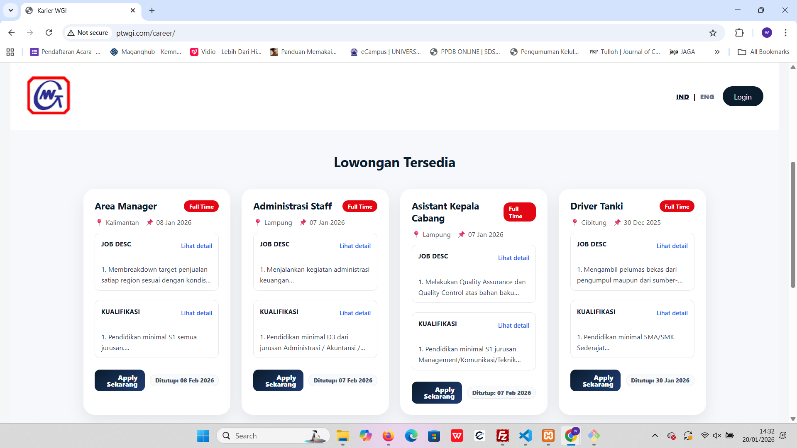

# HRD Project – Website Recruitment

Sistem **Website Recruitment** untuk mendukung proses rekrutmen karyawan secara **digital, terstruktur, dan terintegrasi**, mulai dari publikasi lowongan hingga pengelolaan tahapan seleksi oleh HRD.

---

## 🎯 Tujuan Sistem

* Mempermudah kandidat melamar pekerjaan secara online
* Membantu HRD mengelola data pelamar dan tahapan seleksi
* Monitoring rekrutmen secara real-time
* Mengotomatisasi komunikasi HRD dengan kandidat
* Meningkatkan efisiensi dan profesionalisme proses rekrutmen

---

## 🌐 Portal Karier (Public)

### 🏠 Halaman Karier (Landing Page)

---

### 📋 Lowongan Tersedia

---

### 📝 Form Apply Lamaran

---

### 🔐 Login HRD

---

## 🖥️ Admin Panel HRD

### 📊 Dashboard Admin HRD

---

### 🗂️ Kelola Lowongan

---

### ✏️ Edit Lowongan

---

## 👥 Manajemen Pelamar

### 📄 Data Pelamar

---

### 🔍 Detail & Screening Pelamar (OCR)

**Fitur Utama:**

* Detail biodata pelamar
* Preview CV langsung (PDF Viewer)
* Screening CV berbasis **OCR**
* Skoring otomatis (0–100) untuk membantu seleksi awal

---

## 🧩 Data Seleksi & Tahapan Recruitment

### 📌 Overview Data Seleksi

Menampilkan seluruh kandidat yang masuk ke proses seleksi, lengkap dengan status dan tahapan yang sedang berjalan.

---

### ⭐ Tahapan Favorit

Digunakan HRD untuk menandai kandidat prioritas sebelum masuk ke tahapan seleksi lanjutan.

---

### ☎️ Initiate Call

Tahap komunikasi awal HRD dengan kandidat, dilengkapi:

* Status **Lolos / Tidak Lolos**
* Catatan HRD
* Riwayat proses seleksi

---

### 🎤 Interview (Generate Zoom Otomatis)

**Fitur Khusus:**

* Generate **Link Zoom Interview secara otomatis**
* Link Zoom langsung dikirim ke kandidat
* Mempermudah penjadwalan interview tanpa input manual
* Terintegrasi dengan sistem notifikasi

---

### 📩 Notifikasi WhatsApp Otomatis (Lolos / Tidak Lolos)

**Fitur Otomatisasi:**

* Pesan WhatsApp terkirim **otomatis**
* Template pesan profesional
* Berlaku untuk status **Lolos** dan **Tidak Lolos**
* Mengurangi komunikasi manual HRD

---

### 🧠 Psikotest

---

### 🏥 MCU (Medical Check Up)

---

### 🚀 Onboarding

Tahap akhir kandidat diterima sebagai karyawan dan masuk ke proses onboarding.

---

## 📊 Export & Laporan

**Fitur Export:**

* Export data pelamar (Excel)
* Export data seleksi per tahapan
* Export seluruh proses rekrutmen
* Data siap untuk audit dan evaluasi HRD

---

## 🔗 Link Publish Recruitment

🌐 **[http://ptwgi.com/career/](http://ptwgi.com/career/)**

---

## 🛠️ Teknologi yang Digunakan

* PHP Native
* MySQL
* HTML, CSS, JavaScript
* REST API (Internal & Integrasi)
* WhatsApp API (Notifikasi Otomatis)
* Zoom (Generate Link Interview)
* Git & GitHub
* XAMPP

---

## 👨‍💻 Developer

**Hidayat Tulloh**
Maganghub – Kementerian Ketenagakerjaan RI
Teknik Informatika

Project: **HRD Project – Website Recruitment**

---

© 2026 **PT Wiraswasta Gemilang Indonesia**
